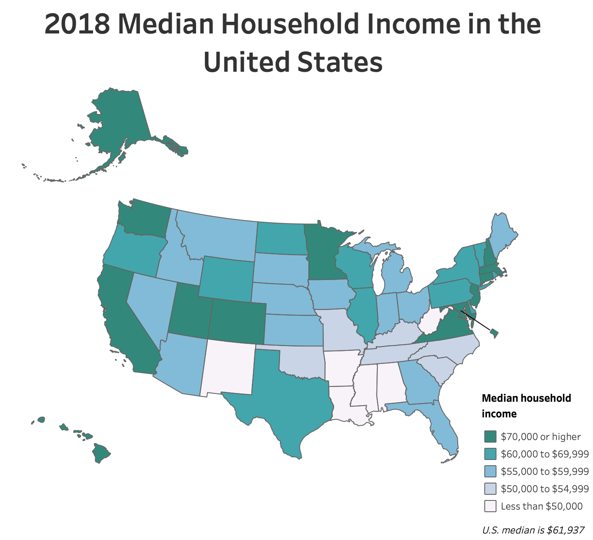
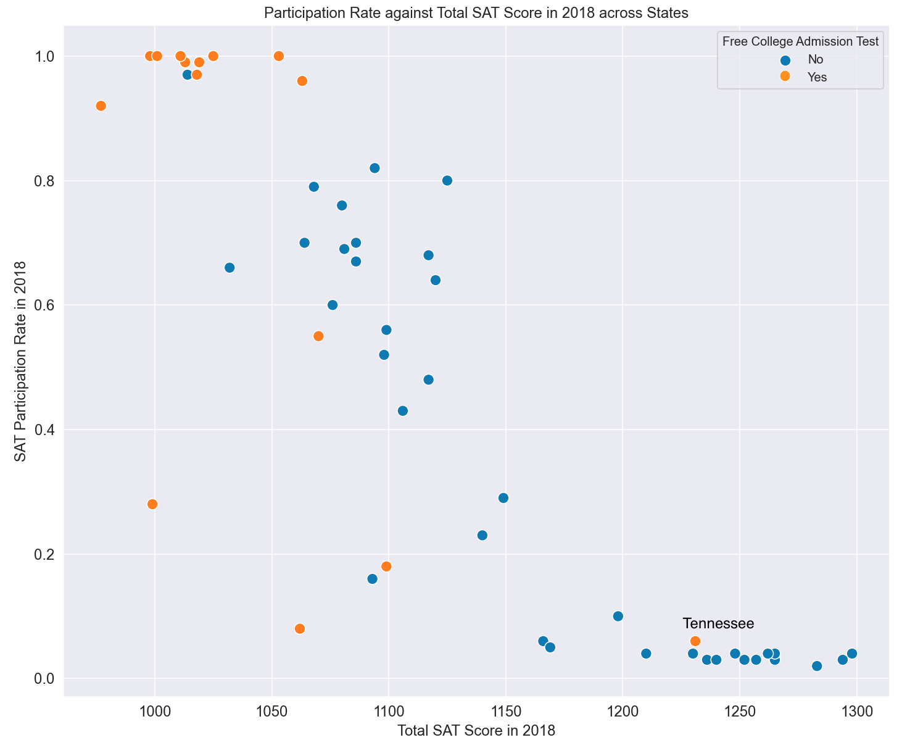

# Project 1 - SAT and ACT Analysis

## Introduction

The Scholastic Aptitude Test (SAT) is one of the college admission tests in the United States, administered by the College Board. In 2018, it surpassed ACT (another popular college admissions test in our analysis) to be the most widely used (Genota, 2018). While it is widely used as a standardised test to measure abilities of students for colleges, some say that the SAT still benefits more privileged students (Buzz, 2019), in spite of a recent attempt to consider socio-economic backgrounds of test takers, through a redesign of the test (College Board, 2014).  

## Problem Statement

Based on the SAT and ACT scores in 2017 and 2018, explore what affects participation rates and from analysis across states, provide recommmendations on how to improve SAT participation rates, in particular. Consider whether income inequality across states continue to affect equal opportunities for students taking the SAT. 

## Analysis 

### Change in Participation Rate between 2017 and 2018
Between 2017 and 2018, we have identified that Colorado had a dramatic increase in SAT participation rate in 2018. The State voted to adopt SAT as a required test as opposed to ACT, because the redesigned SAT measures skills and knowledge like critical thinking and analytical reasoning that are critical for college and career readiness (Colorado Children's Campaign, 2016). This is a strong factor for change towards SAT as Illinois also made the same move (Sarchiapone, 2017) as seen in Figure 1 below. 

*Figure 1 : Participation Rates of ACT and SAT in 2017 and 2018 across States*

### Income Disparity affects Opportunities
A large consideration for deciding whether to attend college is the financial cost. With the financial burden of graduating with debt, it makes more sense for some students to pursue other avenues (Bustamante, 2019). 

Researchers have repeatedly found that wealthy students enjoy significant advantages throughout the college application process, and that income greatly impacts a student's performance on standardised tests, like SAT (Hess, 2019). Wealth vary across states as seen (Figure 2). 

*Figure 2 : 2018 US Median Household Income across States
https://www.census.gov/library/visualizations/interactive/2018-median-household-income.html*

When we consider the income categories of states based on their median household income, we see that most states at the lowest income category of $50,000 have very low SAT participation rates (Figure 3). This is an area which could improve with more effort to promote SAT participation among these states. 

*Figure 3 : 2018 SAT Participation Rate against Total SAT Scores by Income Categories*

### Model State
Tennessee is one of the states from the lower income category, with very low participation rate in SAT but scored very high in the SAT in 2018. 

To partly alleviate the financial burden, some states administer the SATs for free (College Board, 2018).

*Figure 4 : 2018 SAT Participation Rate against Total SAT Scores by Free Admission Test*

Tennessee scored the highest among other states that provide free state-administered SAT tests (Figure 4)

Tennessee also has a free-college program, called Tennessee Promise, which offers two years of tuition-free community college to all, regardless of income, since 2014 (Wermund, 2019). This helped bridged income gaps and made education accessible for all regardless of socio-economic background. (The Future of Education in Tennessee, 2020). This environment probably contributed to high SAT scores for Tennessee. 

### Target State
Alabama is one of the states which belong to the lowest income category with low SAT participation rate but have relatively good SAT scores in 2018 (Figure 3). The State also prioritises education. It has a First Class Pre-K program which was nationally recognised for its high quality every year and education employees received a 2.5% raise (Crain, 2019). 

## Recommendations

Tennessee's approach to education is something to emulate. The College Board is in a unique position to bridge income inequalities among states to make education accessible for all. 

### State Partnership
Form a state partnership with Alabama to adopt SAT School Day which provides free SAT tests for high school students. This would remove cost as a barrier for paticipating in the SATs, which may be a huge concern for students who are not as well to do. Making it state-wide also reinforces how the State values importance of education for all. 

### Maintain Outreach to Students 
Students may feel unprepared for college (Leal, 2015) so more support would be better for them to be convinced that college is achievable. 

### Reach out to Colleges
Encourage colleges to provide free college programs like Tennessee. Leverage on Colorado and Illinois' choices to promote SAT and emphasise value of recently redesigned tests, which make students more college ready. With more State support, this would help alleviate a huge financial burden on the students of Alabama. 

## References
"Ignoring Race and Privilege: How the College Board's SAT Adversity Score Missed the Mark" (Buzz, 2019)
https://equalopportunitytoday.com/2019/06/14/ignoring-race-and-privilege-how-the-college-boards-sat-adversity-score-missed-the-mark/
 
The Redesigned SAT. (College Board, 2014)
[https://www.collegeboard.org/pdf/redesigned-sat/sat-presentation-campus-colleagues]

"Surge helps restore test's dominance"(Genota, 2018)
[https://www.edweek.org/ew/articles/2018/10/31/sat-scores-rise-as-number-of-test-takers.html]

"the redesigned SAT measures skills and knowledge like critical thinking and analytical reasoning that are critical for college and career readiness",  (Colorado Children's Campaign, 2016), 
[https://www.coloradokids.org/wp-content/uploads/2016/01/ACTvsSAT_FINAL.pdf]

"all Illinois high school juniors will take the SAT." (Sarchiapone, 2017)
[https://www.testive.com/author/anthonys/]

"With the financial burden of graduating with debt, it makes more sense for some students to pursue other avenues" (Bustamante, 2019). 
[https://educationdata.org/college-dropout-rates]

"income greatly impacts a student's performance on standardised tests" (Hess, 2019). 
[https://www.cnbc.com/2019/10/03/rich-students-get-better-sat-scores-heres-why.html]

"US Median Household Income (2018). 
[https://www.census.gov/library/visualizations/interactive/2018-median-household-income.html]

"SAT School Day" (College Board, 2018)
[https://reports.collegeboard.org/archive/sat-suite-program-results/2018/sat-school-day]

"Most high school students feel unprepared for college, careers" (Leal, 2015) 
[https://edsource.org/2015/survey-most-high-school-students-feel-unprepared-for-college-careers/83752]

